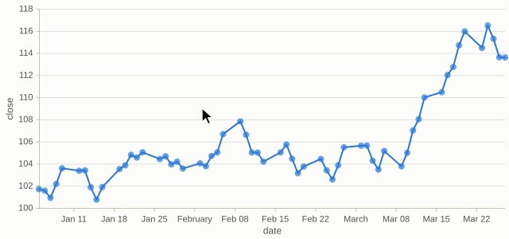
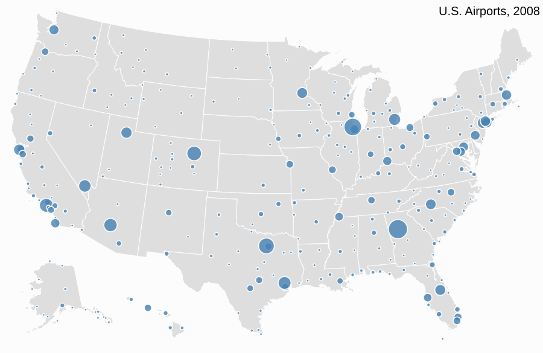
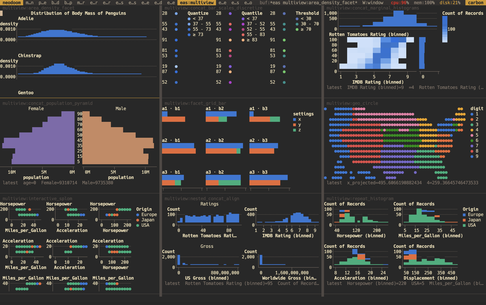
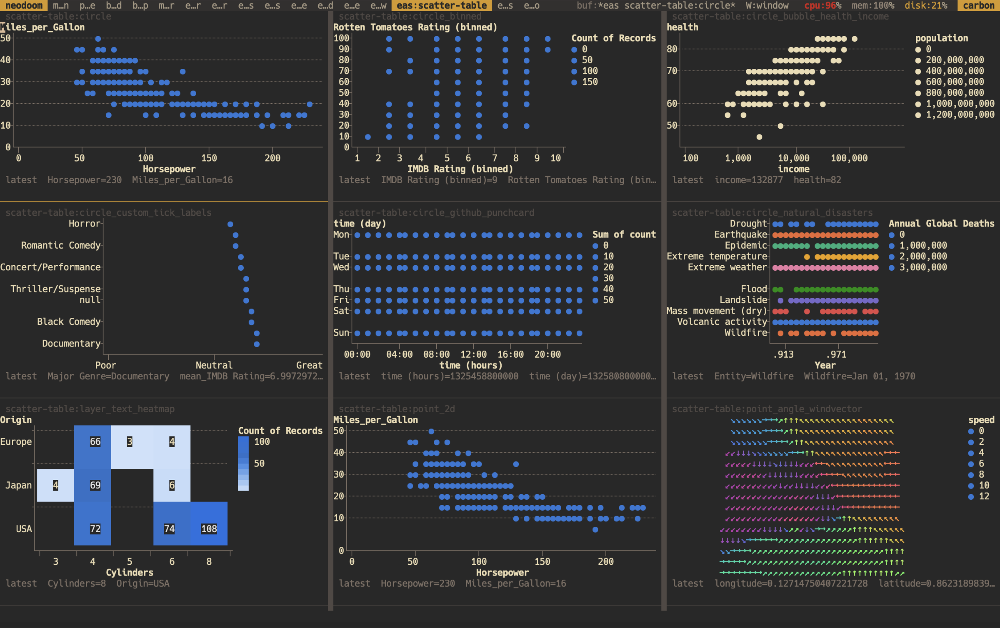
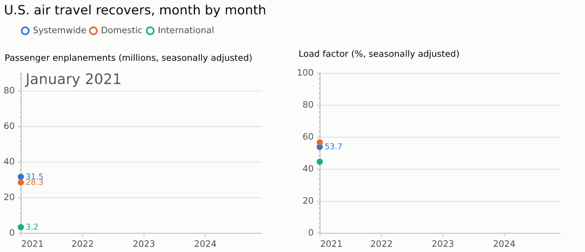
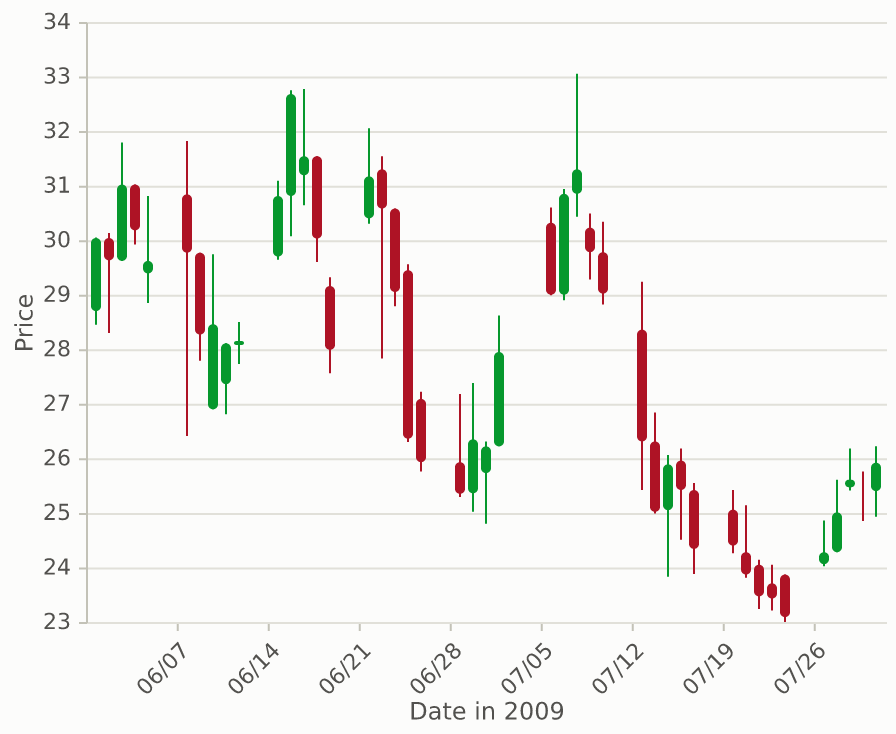
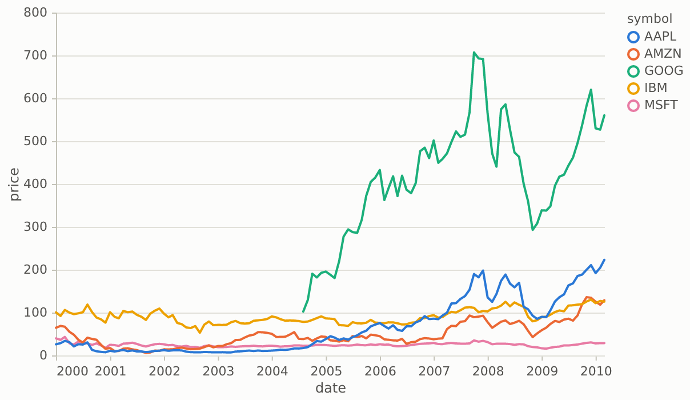
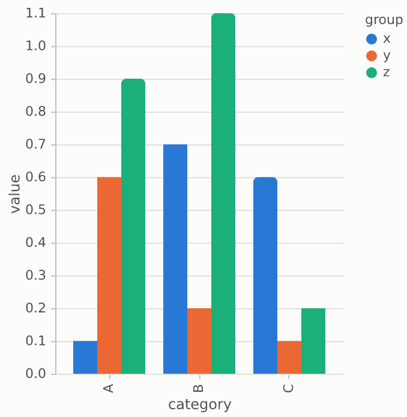
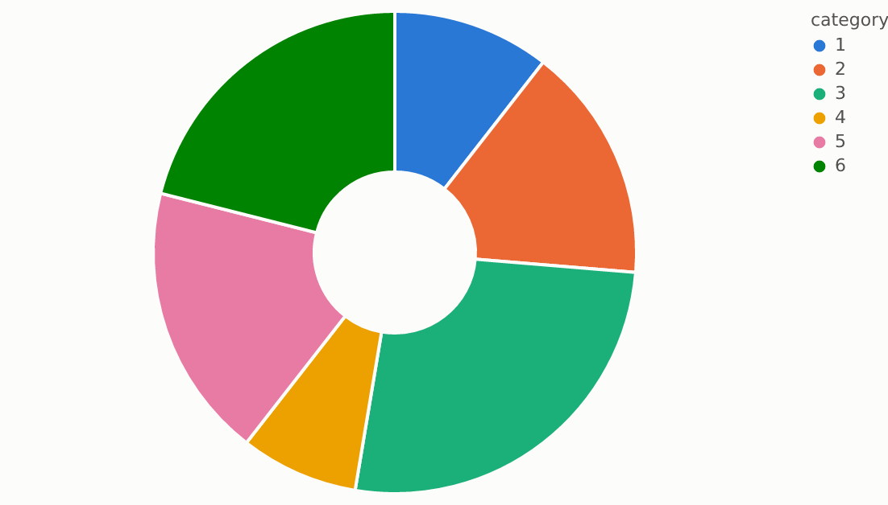

# eas.el

Interactive, agent-drivable charts for Emacs, from declarative JSON.

A chart in eas is a JSON document: a subset of
[Vega-Lite](https://vega.github.io/vega-lite/) 6, plus an `x-eas`
extension namespace for templates, slots and domain transforms. Emacs
feeds data into it and eas draws it in a buffer. A GUI frame gets an SVG
image and a terminal gets text. Everything is Emacs Lisp; there is no
Vega, browser or external process. Charts stay interactive where they
are drawn: hover tooltips, crosshair, zoom and pan, brush, click
actions, linked views, and live streaming data. The same verbs let an
agent read and drive a live chart as data, from Lisp, from the shell
(`bin/eas`), or through `emacsclient`.

The renderer is checked against Vega itself. Of the 200 examples in the
official Vega-Lite gallery, 188 render natively within a pixel threshold
of Vega's own PNGs. The other 12 are topojson maps, which are out of
scope. The same 188 also pass on the text backend.

Every one of the 94 examples in the [Vega gallery](https://vega.github.io/vega/examples/)
is also a template you can bind your own data to: trees, treemaps,
sunbursts, force-directed graphs, word clouds, contours, maps and
projections, and interactive ones down to pacman. `(eas-resolve
"treemap" BINDINGS)`; see `docs/design/vega-gallery-coverage.md`
for what each covers. They take the example's name, except where eas
already has a template of that name: the gallery's heatmap is
`hourly-heatmap` and its histogram `rug-histogram`. The old
`vega/NAME` names still resolve, as deprecated aliases.

## Demos

One runnable demo per interaction of the design table
(`docs/design/engine.md`, section 4), each on a financial-style chart and
a non-financial one (a health or KPI series). Each recording plays the
financial chart, then the other. The GUI recording is SVG frames and the
terminal recording is the text backend's frames; both are driven
headless through `eas-dispatch` (`scripts/eas-animate.el`).

| interaction | demo | financial | non-financial | GUI | terminal |
|---|---|---|---|---|---|
| hover tooltip | [eas-demo-tooltip.el](examples/eas-demo-tooltip.el) | area: ACME close | bars: steps per weekday | [tooltip.gif](docs/screenshots/demos/tooltip.gif) | [tooltip-text.gif](docs/screenshots/demos/tooltip-text.gif) |
| click actions and callbacks | [eas-demo-click.el](examples/eas-demo-click.el) | bars: sector returns, a Lisp callback | line: resting heart rate, copy-row | [click.gif](docs/screenshots/demos/click.gif) | [click-text.gif](docs/screenshots/demos/click-text.gif) |
| brush (interval selection) | [eas-demo-brush.el](examples/eas-demo-brush.el) | line: ACME close | line: resting heart rate | [brush.gif](docs/screenshots/demos/brush.gif) | [brush-text.gif](docs/screenshots/demos/brush-text.gif) |
| legend toggle | [eas-demo-legend.el](examples/eas-demo-legend.el) | multi: three tickers | multi: weekly KPIs | [legend.gif](docs/screenshots/demos/legend.gif) | [legend-text.gif](docs/screenshots/demos/legend-text.gif) |
| zoom and pan | [eas-demo-zoom.el](examples/eas-demo-zoom.el) | series-line: ACME close | area: daily steps | [zoom.gif](docs/screenshots/demos/zoom.gif) | [zoom-text.gif](docs/screenshots/demos/zoom-text.gif) |
| crosshair | [eas-demo-crosshair.el](examples/eas-demo-crosshair.el) | line (crosshair slot): ACME close | multi + rule layer: weekly KPIs | [crosshair.gif](docs/screenshots/demos/crosshair.gif) | [crosshair-text.gif](docs/screenshots/demos/crosshair-text.gif) |
| sliders and params | [eas-demo-sliders.el](examples/eas-demo-sliders.el) | multi: rebase slider | air-traffic: month slider | [sliders.gif](docs/screenshots/demos/sliders.gif) | [sliders-text.gif](docs/screenshots/demos/sliders-text.gif) |
| live push and stream | [eas-demo-live.el](examples/eas-demo-live.el) | series-line: ACME ticks | line: heart-rate monitor | [live.gif](docs/screenshots/demos/live.gif) | [live-text.gif](docs/screenshots/demos/live-text.gif) |
| linked views | [eas-demo-linked.el](examples/eas-demo-linked.el) | series-line: overview and detail | area: overview and detail | [linked.gif](docs/screenshots/demos/linked.gif) | [linked-text.gif](docs/screenshots/demos/linked-text.gif) |
| drill | [eas-demo-drill.el](examples/eas-demo-drill.el) | bars: monthly volume -> daily closes | bars: weekly steps -> days | [drill.gif](docs/screenshots/demos/drill.gif) | [drill-text.gif](docs/screenshots/demos/drill-text.gif) |

Run one from the repository root: `emacs -Q --batch -L src -l
examples/eas-demo-brush.el` prints the text chart and what inspect
answers after each event; `emacs -Q -L src -l examples/eas-demo-brush.el`
opens both charts in eas-mode buffers to drive by hand;
`EAS_DEMO_RECORD=1` in batch re-records the two GIFs (rsvg-convert and
ImageMagick needed). An agent's end-to-end session, from `bin/eas
describe` to a brush and `export --vl`, is in
[docs/agent-transcript.md](docs/agent-transcript.md).



## Screenshots

Hovering airport after airport on the `airport-connections` template
draws each one's routes, driven headless with `eas-dispatch` pointer
events and drawn by the SVG renderer (`scripts/eas-animate.el`, job
`scripts/animations/airport-connections.json`):



The same tour in the text backend, as a terminal shows it, with the
tooltip in the echo area:
[airport-connections-text.gif](docs/screenshots/animations/airport-connections-text.gif).

Live views in a terminal Emacs, a 3×3 grid of official Vega-Lite gallery
examples per workspace, every one drawn by eas's text backend:





More: every gallery group as a composite in
[docs/screenshots/composites](docs/screenshots/composites) and each chart
on its own in [docs/screenshots/charts](docs/screenshots/charts).

### Animation

Templates can play. `air-traffic` animates the recovery of U.S. air
travel from the BTS Air Traffic tables (2021-2024), month by month: an
x-eas timer advances a `month` param, space pauses, the arrows and a
month slider scrub. Its data, fields and series are slots, so any
monthly table animates the same way. Drawn by the SVG renderer, one
frame per tick (`scripts/eas-animate.sh air-traffic OUT.gif 48 250
'{"month": 1}'`):



### SVG backend

These come from the native SVG renderer (`scripts/eas-screenshots.sh`,
rasterized for this page) drawing examples from the official gallery:

| | |
|---|---|
|  |  |
|  |  |

In a terminal the text backend draws the same candlestick chart. Each
cell carries `help-echo` and the datum behind it, so moving point over
the chart works as hover:

```
Price
34┤┈┈┈┈┈┈┈┈┈┈┈┈┈┈┈┈┈┈┈┈┈┈┈┈┈┈┈┈┈┈┈┈┈┈┈┈┈┈┈┈┈┈┈┈┈┈┈┈┈┈┈┈┈┈┈┈┈┈┈┈┈┈┈┈┈┈┈┈┈┈┈┈┈┈┈┈┈
  │                                               │
  │                   █│                          │
32┤┈┈┈┈┈┈┈┈┈│┈┈┈┈┈┈┈┈┈█│┈┈┈┈┈┈│┈┈┈┈┈┈┈┈┈┈┈┈┈┈┈┈┈┈┈│┈┈┈┈┈┈┈┈┈┈┈┈┈┈┈┈┈┈┈┈┈┈┈┈┈┈┈┈┈
  │   │     │         ██ ▒    ││                  │
  │   █▒│   │        │█│ ▒    █▒                 │█
  │   █▒│   ▒        █││ ▒    █│▒              │ █│││
30┤█▒┈█││┈┈┈▒│┈│┈┈┈┈┈█│┈┈│┈┈┈┈┈│▒┈┈┈┈┈┈┈┈┈┈┈┈┈┈▒┈█┈▒│┈┈┈┈┈┈┈┈┈┈┈┈┈┈┈┈┈┈┈┈┈┈┈┈┈┈┈
  │█│   █   │▒ │          │    │▒▒             ▒ █ │▒   │
  │█│   │   │▒ │          ▒    ││▒        │    │ │  │   │
28┤││┈┈┈┈┈┈┈││┈█│━┈┈┈┈┈┈┈┈▒┈┈┈┈│┈▒┈┈┈┈┈┈┈┈│┈┈┈┈┈┈┈┈┈┈┈┈┈▒┈┈┈┈┈┈┈┈┈┈┈┈┈┈┈┈┈┈┈┈┈┈┈
  │         ││ ██│        │    │ ▒        █             ▒
  │         │  █│                ▒ │  │ │ █             ▒
  │         │   │                ▒ ▒  │ ││█             ▒│
26┤┈┈┈┈┈┈┈┈┈┈┈┈┈┈┈┈┈┈┈┈┈┈┈┈┈┈┈┈┈┈┈┈▒┈┈│┈██│┈┈┈┈┈┈┈┈┈┈┈┈┈│▒┈││┈┈┈┈┈┈┈┈┈┈┈┈┈┈┈│┈││
  │                                   ▒ █│              │▒ █▒│   │         │━ │█
  │                                     ││               │ ││▒   ▒│       │█  ││
  │                                                        ││▒   │││      ██
24┤┈┈┈┈┈┈┈┈┈┈┈┈┈┈┈┈┈┈┈┈┈┈┈┈┈┈┈┈┈┈┈┈┈┈┈┈┈┈┈┈┈┈┈┈┈┈┈┈┈┈┈┈┈┈┈┈┈│┈│┈┈┈┈▒▒┈▒▒┈┈┈│┈┈┈┈┈
  │                                                                │ │▒
  └────────┬────────┬────────┬───────┬────────┬────────┬────────┬────────┬──────
         06/07    06/14    06/21   06/28    07/05    07/12    07/19    07/26
                                    Date in 2009
```

Rising candles are solid and falling ones are shaded. Lines use
braille, and bars and areas use eighth blocks.

## Install

eas needs GNU Emacs 30.1 or newer and has no other dependencies.

```elisp
;; From a checkout:
(add-to-list 'load-path "~/src/eas.el/src")
(require 'eas)

;; Or with package-vc (Emacs 30):
(package-vc-install '(eas :url "https://github.com/davidawad/eas.el" :lisp-dir "src"))
```

The templates live in `templates/` beside `src/`, and eas finds them
from where `src/` is: next to the libraries in a flat install (MELPA,
recipe in `recipes/eas`), else one level up. To add your own, push directories onto
`eas-template-directories`.

## Optional: the geo accelerator

eas has no dependencies. The Rust module is an optional accelerator for
map projections. Without it eas uses pure Elisp and everything works:
the same maps, byte for byte. Pure Elisp stays the source of truth;
the module only speeds up the projection math (project, resample,
clip and path printing), which is most of a map's first render
(`docs/design/geo-first-render.md`).

Building it needs [Rust](https://rustup.rs) (cargo) and the Emacs
module header `emacs-module.h`, which comes with your Emacs's
development files. eas finds the header beside the running Emacs or
under the usual prefixes; set `EMACS_MODULE_HEADER` to point at it
otherwise. Any one of these builds it:

```sh
make module                # in a checkout; EMACS=... picks the Emacs
bin/eas module             # the same, from the shell entry point
make module-clean          # remove it again
```

- `M-x eas-geo-build-module` builds it from inside Emacs, in a
  compilation buffer, then offers to load it. For an install without
  the crate (MELPA), set `eas-geo-build-source-directory` to the
  `module/` directory of a checkout first.
- Homebrew: the tap formula (draft in `packaging/eas.rb.in`) builds it
  at install time.
- Each release attaches prebuilt modules for macOS (arm64, x86_64) and
  Linux (x86_64, arm64) as `eas-geo-module-<os>-<arch><suffix>`, with a
  `SHA256SUMS` file. Save one as `lib/eas-geo-module<suffix>` under the
  eas root.

The module installs as `lib/eas-geo-module<suffix>` under the eas root
(beside the libraries in a flat install), where `<suffix>` is the
running Emacs's `module-file-suffix` (`.so` on Linux, `.dylib` or `.so`
on macOS). eas loads it lazily, the first time a map needs it.

`eas-geo-backend` picks the backend:

| value | behaviour |
|---|---|
| `auto` (default) | use the module if it loads, else Elisp |
| `native` | use the module; a clear `user-error` if it is missing or fails to load |
| `lisp` | never load the module |

`M-: (eas-geo-backend-active)` returns `native` or `lisp`, the backend
in use. The environment variable `EAS_GEO_BACKEND` (`lisp`, `native` or
`auto`) sets the initial value of `eas-geo-backend`, so `EAS_GEO_BACKEND=lisp
eas render ...` draws without the module.

Measured first renders: open the template and print its SVG in a fresh
`emacs -Q --batch`, garbage collection included, best of 6, on an 8-core
Linux box (4 CPUs of quota) with Emacs 30.1, in ms
(`scripts/eas-spikes/geo-first-render.sh`, `docs/design/geo-first-render.md`):

| template | Elisp, byte | module, byte | Elisp, native-comp | module, native-comp |
|---|---:|---:|---:|---:|
| projections | 2592 | 313 | 2196 | 237 |
| county-unemployment | 1571 | 262 | 1397 | 196 |
| map-with-tooltip | 751 | 230 | 601 | 178 |
| world-map | 141 | 27 | 118 | 22 |

Both backends draw byte-identical SVG.

## Quick start

### Lisp

```elisp
(require 'eas)

;; A template with its example bindings, shown in a buffer: SVG in a GUI
;; frame, text in a terminal.
(eas-show (eas-view-open "line" :bindings (eas-template-example "line")))

;; Any Vega-Lite spec in the native subset, as a plist (or a JSON string or file).
(eas-show
 (eas-view-open
  '(:data (:values [(:k "a" :v 3) (:k "b" :v 5) (:k "c" :v 2)])
    :mark "bar"
    :encoding (:x (:field "k" :type "nominal") :y (:field "v" :type "quantitative")
               :tooltip [(:field "k") (:field "v")]))))

;; Live data: push rows into an open view.
(eas-push view [(:date "2026-03-12" :value 111.2)])

;; A keyed live table (an order book): replace, append or delete by key.
(eas-push book [(:price 101.5 :size 7)] :key "price")
(eas-push-delete book "price" '(101.0))

;; Every agent verb, returning the chart/v1 envelope as a plist.
(require 'eas-agent)
(eas-agent "render" "line" :data (eas-template-example "line") :backend "text")
```

In a chart buffer, `+`/`-`/`0` zoom in, zoom out and reset. `<`/`>`
and the shifted arrows pan. The arrows pan in a GUI frame and move
point (which hovers) in a terminal. `[`/`]` step back and forward
through zoom history, `RET` clicks the datum at point, `c` or `ESC`
clears the selection, and `g` refreshes. In a GUI frame the mouse
hovers, drags to brush or pan, zooms with the wheel, and clicks.

In org, `#+begin_src eas :template bars :data tbl` draws an
interactive chart inline under the block. Clicking a datum jumps to its
table row. See `examples/eas.org`.

### Shell: `bin/eas`

`bin/eas` runs the stateless verbs in a batch Emacs. Each prints the
chart/v1 envelope as JSON, or the raw payload with `--raw`. It exits
0 when ok and 1 otherwise.

```sh
bin/eas describe templates                 # every template, its slots and example
bin/eas example line --raw > line.json     # bindings that render as-is
bin/eas check line --data line.json        # reason codes with JSON paths
bin/eas render line --data line.json --backend text --cols 60 --rows 14 --raw
bin/eas render spec.vl.json --backend svg --raw > chart.svg
bin/eas export line --data line.json --vl  # resolved, pure Vega-Lite
echo '{"mark":"bar", ...}' | bin/eas check -
bin/eas doctor
```

### A running Emacs: `emacsclient`

The live verbs (`open`, `views`, `inspect`, `dispatch`, `log`,
`selection`, `link`) go to the Emacs that holds the views:

```sh
emacsclient --eval '(progn (require (quote eas-agent)) (eas-agent-json "open" "line" :data "/path/to/line.json" :id "daily" :show t))' | jq -r . | jq .
emacsclient --eval '(eas-agent-json "dispatch" "daily" "{\"type\":\"key\",\"key\":\"+\"}")' | jq -r . | jq .data.views
emacsclient --eval '(eas-agent-json "inspect" "daily")' | jq -r . | jq .data
emacsclient --eval '(eas-agent-json "log" "daily")'   | jq -r . | jq .data
```

`emacsclient` prints a Lisp string, so `jq -r .` unwraps it into JSON.
An agent can see what the human is looking at (domains, selection,
hovered datum, the event log) and drive the chart with the same events
a mouse produces.

## Verbs

Every surface has the same verbs and returns the same envelope,
`{"contract": "chart/v1", "ok", "data", "reason"?, "evidence"?, "next": [...]}`.
Failures are data. Each one carries a stable reason code (`SLOT_MISSING`,
`UNSUPPORTED_FEATURE` with its JSON path, `VIEW_NOT_FOUND`, ...) and at
least one `next` command. `batch` verbs run anywhere, including
`bin/eas`. `live` verbs need the Emacs that holds the views.

| verb | where | answer |
|---|---|---|
| `describe [templates\|transforms\|adapters\|supported\|verbs\|events\|reasons]` | batch | Templates with slots and examples, transforms, adapters, supported features, verbs, events, reasons |
| `example TEMPLATE` | batch | Bindings for TEMPLATE that render as-is |
| `check SOURCE [--data BINDINGS]` | batch | Resolve, validate and compile without drawing; reason codes with paths |
| `explain SOURCE [--data B] --stage resolve\|compile\|scene [--backend svg\|text]` | batch | The intermediate artifact at one layer |
| `render SOURCE [--data B] [--backend text\|svg] [--cols C --rows R \| --width W --height H]` | batch | The chart as text (deterministic) or SVG |
| `export SOURCE [--data B] --vl` | batch | Resolved pure Vega-Lite for other renderers and documents |
| `bench [SOURCE] [--budget]` | batch | Measured latency (ms): the 1k/10k/100k ladder, or one SOURCE's resolve, compile, render and hover |
| `doctor` | batch | Health rows (`name`, `status` pass\|fail\|skip, `detail`, `remediation`) |
| `open SOURCE [--data B] [--id ID] [--backend svg\|text] [--show]` | live | Open SOURCE as a live view; `--show` displays it |
| `views` | live | Live views: id, template, buffer, size, last event |
| `inspect VIEW` | live | Domains, selections, hovered datum and visible-range summary |
| `dispatch VIEW EVENT` | live | Apply an event/v1 (or replay an array of them); returns inspect |
| `log VIEW [--n N]` | live | VIEW's recent events, oldest first |
| `selection VIEW [--name PARAM] [--as rows\|json\|org]` | live | Rows selected in VIEW |
| `link VIEW BUS [--params NAME,NAME]` | live | Join VIEW to a param bus: hover, brush and zoom follow across views |
| `unlink VIEW [--bus BUS]` | live | Take VIEW out of BUS (default: every bus) |
| `buses` | live | Param buses: params carried, members, last stores |
| `close VIEW` | live | Forget VIEW |

SOURCE is a template name or a chart/v1 spec: a file, inline JSON, or
`-` for stdin. `bin/eas describe verbs` gives the full usage of each
verb.

## Templates

A template is a chart/v1 spec with declared, typed slots. It lives in
`templates/NAME.json`, and `examples/NAME.data.json` holds bindings that
render as-is. This package ships `line`, `series-line`, `multi`, `area`,
`bars`, `histogram`, `heatmap`, `sparkline` and the animated
`air-traffic`. A domain package, such

`bars`, `histogram`, `heatmap` and `sparkline`, plus the gallery
templates of `templates/vega/` (`treemap`, `sunburst`, ...). A domain package, such
as financial-chart.el with its candlestick, depth and payoff charts,
supplies only templates and transforms
(`eas-register-transform`). It never draws.

A package registers its own directory under a namespace, so its names
cannot collide with another package's:

```elisp
(eas-template-add-directory "/path/to/health-charts/templates" "health")
;; templates/lab-trend.json is now "health/lab-trend"; "lab-trend"
;; still finds it while no other namespace has one.
```

A template file that fails to load is skipped and reported
(`eas-template-load-errors`, `bin/eas doctor`, `describe`); the others
still load. Inside a template body:

| form | becomes |
|---|---|
| `{"x-eas:slot": S}` | slot S's value; a null value leaves the property out |
| `{"x-eas:slot": S, "key": "a.b", "default": D}` | a part of an object (or array) slot |
| `{"x-eas:expr": "datum.v > {{limit}}"}` | a string, each `{{S}}` or `{{S.key}}` a JSON literal (`{{@KEY}}` reads the each item) |
| `{"x-eas:text": "Average {{metric}}"}` | the same, string values inserted as they are |
| `{"x-eas:when": S, "spec": X}` in an array | X while slot S is truthy |
| `{"x-eas:each": S, "spec": X}` in an array | one X per item of S; S may be an `{"x-eas:item": KEY}`, so eaches nest, and `"../KEY"` reads the enclosing item |

A template may hold a facet, and a wrapped `concat` (`"columns"`) whose
views an `x-eas:each` expands.

## Interaction

### Hover readout

Every live chart reserves its readout lines under the plot before the
first draw, whether or not anything is hovered. The plot is compiled
that much shorter. Hovering then changes only the readout's own cells
(and pixels in a GUI frame), never the chart's layout. By default the
readout is one line, the values strip:

```
 latest  date=Mar 11, 2026  value=109
 cursor  date=Mar 05, 2026  AAPL=106.3  MSFT=98.2
```

The readout stays on one line. When it is too long, the fit first drops
the lowest-priority fields, then abbreviates labels (`volume=` becomes
`vol=`), then shortens numbers (`1234567` becomes `1.23M`), then elides
with `…`. It wraps only when `max_lines` allows more than one line.
Tooltips shown in the echo area also stay on one line, because a taller
echo area would resize the chart's window. The header line exists from
the start for the same reason.

A chart says what its readout shows in `x-eas.readout`. The short form
is a list of fields:

```json
"x-eas": {"readout": {
  "max_lines": 1,
  "separator": "  ",
  "fields": [
    {"field": "date", "format": {"type": "time", "pattern": "%b %d, %Y"}, "priority": 100},
    {"field": "close", "label": "C", "labelSep": " ", "priority": 90,
     "format": {"type": "number", "decimals": 2},
     "rules": [{"test": "datum.close >= datum.open", "color": "green", "bold": true},
               {"test": "datum.close < datum.open", "color": "red"}]},
    {"field": "volume", "short": "v", "format": {"type": "si"}, "priority": 10},
    {"field": "note", "rules": [{"test": "!datum.note", "hide": true}]}]}}
```

A field has `field` (a datum field) or `value` (any value, often
`{"expr": ...}`), plus `label` (the field name by default), `short`
(the abbreviated label), `labelSep` (`=` by default), `format`,
`priority` (higher stays longer, 50 by default), `keep`, `style`,
`labelStyle` and `rules`. A format is a d3-format string, or
`{"type": "number" | "percent" | "currency" | "time" | "si",
"decimals": N, "symbol": "$", "pattern": "%b %d"}`. Each format has a
shorter form that the fit uses. Every rule whose Vega-expression `test`
holds on the datum applies its `color`, `background`, `bold`, `italic`,
`dim` and `underline`, or `hide`s the field.

#### Components

The readout is a tree of components, in the style of React. A component
is a named, registered renderer that takes props and a context (the
datum, the view and the theme) and returns styled output for both
backends: propertized text in terminals and SVG `<tspan>`s in GUI
frames. A prop may be `{"expr": E}`, evaluated on the datum. In
expressions, `at` is `"cursor"` or `"latest"`, `hovered` says whether a
datum is hovered, and `view` is the view id.

```json
"x-eas": {"readout": {"component": "row", "props": {"sep": "  "}, "children": [
  {"component": "when", "props": {"test": "hovered"},
   "children": [{"component": "text", "props": {"template": "{date}"}}],
   "else": [{"component": "text", "props": {"text": {"expr": "at"}, "priority": 10}}]},
  {"component": "field", "props": {"field": "close", "format": {"type": "currency"}}},
  {"component": "when", "props": {"test": "datum.close >= datum.open", "style": {"color": "green"}},
   "children": [{"component": "badge", "props": {"text": "UP", "background": "green"}}],
   "else": [{"component": "badge", "props": {"text": "DOWN", "background": "red"}}]},
  {"component": "sep"},
  {"component": "sparkline", "props": {"values": {"expr": "[datum.low, datum.open, datum.close, datum.high]"}}},
  {"component": "fields", "props": {"source": "hover", "priority": 20}}]}}
```

| component | props | draws |
|---|---|---|
| `text` | `text` or `template` (`{field}` placeholders), `short` | a literal |
| `field` | see above | `label=value` |
| `row` | `sep` (two spaces), `style`; children | children side by side |
| `when` | `test` (required), `style`; children, `else` | children when `test` holds (with `style` over them), else the `else` branch; with a `style` and no `else`, the children unstyled |
| `sep` | `text` (` │ `), `style` | a separator, dropped at a line's ends |
| `badge` | `text`, `color`, `background` | ` TEXT ` on a background |
| `sparkline` | `values` (an array), `max` | `▁▃▅█` |
| `fields` | `source` (`auto`, `strip`, `hover`), `labelSep`, `sep`, `priority` | the view's own fields: the strip, or the hovered datum's tooltip |

`text`, `field`, `badge` and `sparkline` also take `priority`, `keep`
and `style`. A string is a text node, an object with `field` is a field
node, and `{"fields": [...]}` is a row. Props are checked against each
component's schema. A fault, such as an unknown component, an unknown
prop, a wrong type or a missing required prop, is an `INVALID_INPUT`
error with a JSON path like `/x-eas/readout/children/1/props/labl`.
`eas-readout-validate` raises it. A live readout shows it in place
instead of breaking the chart.

Fitting measures the whole tree before rendering anything, so dropping,
abbreviating and eliding work across nested components. Each
component's output is a list of atoms. An atom is the unit that is
dropped whole, and it carries a full, a short and a shorter form.

Packages register their own components with `eas-define-component`:

```elisp
(eas-define-component "ohlc-change"
  :doc "Close minus open, colored by sign."
  :props '((up :type color :default "green")
           (down :type color :default "red")
           (decimals :type integer :default 2))
  :render
  (lambda (props ctx)
    (let* ((d (plist-get ctx :datum))
           (x (- (plist-get d :close) (plist-get d :open))))
      (list (eas-component-atom
             (list (eas-component-span
                    (format (format "%%+.%df" (plist-get props :decimals)) x)
                    (list :color (plist-get props (if (>= x 0) :up :down)))))
             :priority 70)))))
```

The props schema lists `(NAME :type TYPE :default D :required R :enum
VALUES :doc S)`. TYPE is one of `string number integer boolean color
style format expr array rules any`. RENDER receives the props, already
validated, with defaults applied and expressions evaluated, and a
context: `:datum :view :theme :env :given :path`, plus `:children`
when the component is defined with `:children t`.
`eas-component-render-children` renders those children (one list of
atoms per child) and `eas-component-restyle` lays a style over atoms.
`eas-component-atom SPANS &key short shorter priority keep role` builds
an atom, and `eas-component-span TEXT STYLE` a span. STYLE is a plist
of `:color :background :bold :italic :dim :underline`.

For anything a spec cannot say, `eas-readout-functions` is the Lisp
hook. Each function receives the datum, the view and the context and
may return propertized text. The first non-nil result is the readout,
fitted to the reserved lines like a component's output. Add a function
buffer-locally to change one chart's readout:

```elisp
(add-hook 'eas-readout-functions
          (lambda (datum _view _ctx)
            (when datum
              (propertize (format "close %s" (plist-get datum :close)) 'face 'bold))))
```

Textual tooltips use the same API. `x-eas.tooltip` is a component tree
for the hovered datum, shown on one line in the echo area or in a GUI
tooltip frame.

## Callbacks

A click on a chart (mouse-1 in a GUI frame, `RET` at point in a
terminal, or a `click` event an agent dispatches) runs a callback you
set up ahead of time, typically in `init.el` before any chart exists:

```elisp
(with-eval-after-load 'eas
  ;; Bars of the "bars" template: big days and the rest differ.
  (eas-define-callback "bars" "main/0"
    (lambda (target _view)
      (message "Big day: %s" (plist-get (plist-get target :row) :category)))
    :when "datum.value > 7000"
    :doc "Announce big days.")
  (eas-define-callback "bars" "main/0" #'eas-copy-row-callback)
  ;; Any chart: an x-axis label, the title, the empty plot.
  (eas-define-callback nil "axis:x"
    (lambda (target _view) (message "Column %s" (plist-get target :value))))
  (eas-define-callback nil "title"
    (lambda (target _view) (message "Title: %s" (plist-get target :title))))
  (eas-define-callback nil "background"
    (lambda (target _view)
      (message "x=%s y=%s" (plist-get target :x) (plist-get target :y)))))

(defun eas-copy-row-callback (target _view)
  "Copy the clicked row as JSON."
  (kill-new (eas-json-encode (plist-get target :row))))
```

`eas-define-callback TEMPLATE KEY FN &key when doc args` adds an entry
to `eas-action-default-bindings` (TEMPLATE nil means any view;
re-evaluating the same template, key and `:when` replaces it).
`eas-remove-callback` takes it out. KEY is what the click landed on:

| key | target | the target plist holds |
|---|---|---|
| a mark id (`main/0`) or click param name | a datum | `:view :mark :datum :row :tooltip :href :px`, data-space `:x :y`, `:fields` |
| `legend` or the legend param's name | a legend entry | `:legend CHANNEL :value :label :param :selected` |
| `axis:x`, `axis` | an axis label or tick, or the axis title | `:area "axis" :axis :part "label"\|"title" :value :label :title` |
| `title` | the chart title, subtitle or a facet header | `:area "title" :part :title` |
| `background` | the empty plot | `:area "background" :view :x :y :fields` |
| `*` | any datum (never legends or areas) | |

FN is called with the target and the view; a string or number it
returns is recorded as the click's `:result`, and an error as `:error`
(the click never breaks). `:when` is a Vega expression evaluated on the
datum (the row; for areas, the target itself, so `datum.value` or
`datum.x`; `target` names the whole target) or a predicate function of
target and view. Several entries for one key are tried in order, so
regions of one mark can run different callbacks. Entries with a
`:when` come before unconditional ones (each group keeps its order),
so a catch-all defined first never shadows a later `:when` entry; the
first unconditional entry runs when no `:when` holds. Exactly one
callback runs per click. FN may also be a
registered action name (`echo`, `copy-row`, `drill`, ...).

Per view, `(eas-action-bind VIEW KEY BINDING)` takes the same bindings:
an action name, a function, `(:fn FN :when P ARG V ...)`,
`(:action NAME ...)`, or a vector of them. A template binds them in
JSON: `"x-eas": {"actions": {"main/0": [{"action": "echo", "when":
"datum.v > 2"}]}}`. For each key the view's binding wins, then global
entries for its template, then the template's actions, then global
entries for any view; the `:when`-first order applies inside each of
these, so a template's catch-all still beats a global `:when` entry. `eas-inspect` shows the last click with the
action it ran.

## Fonts

The SVG backend honours Vega-Lite's font properties: `config.font`,
`title.font`, `axis.labelFont` and `titleFont`, legend fonts and a text
mark's `font`. Layout measures chart titles, axis labels and text
marks in their own font, and all other text in `config.font`. Arial, Times New Roman and the monospace families are built in. For
any other family, register its font file, TrueType (`.ttf`) or
OpenType (`.otf`), and eas measures it with the file's own advance
widths:

```elisp
(eas-font-register "~/fonts/Inter-Regular.ttf")              ; family "Inter", from the file
(eas-font-register "~/fonts/Inter-Bold.ttf" :weight 700)
```

A chart can carry its fonts. Resolve registers them, and the exported
Vega-Lite keeps only the family names. A relative `src` is found
beside the template file:

```json
{"x-eas": {"fonts": [{"src": "fonts/Inter-Regular.ttf"}]},
 "config": {"font": "Inter"}, "...": "..."}
```

The SVG gets an `@font-face` rule for every registered font the chart
names. `eas-svg-font-embed` decides how: `url` (the default) links the
file, `data` inlines it so an exported SVG stands alone, and nil writes
no rule. Emacs draws SVG with librsvg, which ignores `@font-face` and
finds fonts through fontconfig. An Emacs frame therefore draws a
registered family only when the font is also installed (for example in
`~/.local/share/fonts`). Layout is measured from the file either way.

Font settings apply to SVG only. The text backend draws every glyph in
one cell of the frame's own faces, so a terminal chart ignores them.

## Vega-Lite coverage

The native subset is measured against the official Vega-Lite 6.4.1
gallery and the reference PNGs that Vega rendered for it
(`test/vl-examples/`). Each row below is that group's `status.json`;
`docs/design/gallery-coverage.md` has the details.

- **pass**: both backends render, and the native SVG is within the
  example's pixel threshold of the reference. It also lays out without
  overlap at three pixel sizes and three cell sizes.
- **partial**: it renders but misses one of those checks. The reason is
  in `status.json`.
- **unsupported**: native compile refuses it. The reason names the
  feature.
- **text**: the example opens as a live text view and passes
  `eas-text-check` at 60x16, 100x30 and 160x45.
- **custom**: customization specs written for this project that set
  non-default properties.

| group | pass | partial | unsupported | examples | text pass | text partial | custom | custom with ref | custom ref-pending |
|-------|-----:|--------:|------------:|---------:|----------:|-------------:|-------:|----------------:|-------------------:|
| area-circular | 13 | 0 | 0 | 13 | 13 | 0 | 3 | 3 | 0 |
| bar | 24 | 0 | 0 | 24 | 24 | 0 | 6 | 6 | 0 |
| calculations | 21 | 0 | 0 | 21 | 21 | 0 | 7 | 7 | 0 |
| distributions | 19 | 0 | 0 | 19 | 19 | 0 | 8 | 8 | 0 |
| interactive | 31 | 0 | 1 | 32 | 31 | 0 | 6 | 0 | 6 |
| layered | 19 | 0 | 0 | 19 | 19 | 0 | 6 | 2 | 4 |
| line | 20 | 0 | 0 | 20 | 20 | 0 | 2 | 2 | 0 |
| multiview | 19 | 0 | 11 | 30 | 19 | 0 | 6 | 0 | 6 |
| scatter-table | 22 | 0 | 0 | 22 | 22 | 0 | 4 | 4 | 0 |
| **total** | **188** | **0** | **12** | **200** | **188** | **0** | **48** | **32** | **16** |
| templates | | | | | 8 | 0 | | | |

The 12 unsupported examples are the topojson maps: 11 in multiview, plus
`airport_connections` in interactive. A spec outside the native subset
still opens. Its view is static and lists each `UNSUPPORTED_FEATURE`
with its path. `check` names every documented property that the
renderers do not draw, so no chart is drawn differently from Vega-Lite
without a warning. `src/supported.json`, generated from the conformance
gallery, records what the engine can draw.

## Development

```sh
make test                  # unit, golden and runtime tests (about 2 min)
make compile               # checkdoc, then byte-compile with warnings as errors
make test-gallery-bar      # one official gallery group (one Emacs per group)
make test-gallery-conformance
make test-gallery          # every group, one after another
make bench                 # latency ladder against src/bench-budget.json
make tty-check             # real-terminal check in tmux (private server -L eas)
make module                # optional: build the Rust geo module (needs cargo)
make clean
```

`EAS_UPDATE_GOLDEN=1` rewrites goldens so you can review them as diffs.
`TEST_SKIP_LOG=FILE` lists skipped tests with their reasons. The image
oracle needs `rsvg-convert`. Rebuilding the reference PNGs needs
`bin/chart`, a separate static renderer; without it those checks skip
and say so. The design, its layer contracts and the measured spikes are
in `docs/design/`. `AGENTS.md` has the working rules for this repository.

## License

GPL-3.0-or-later. See `LICENSE`.
